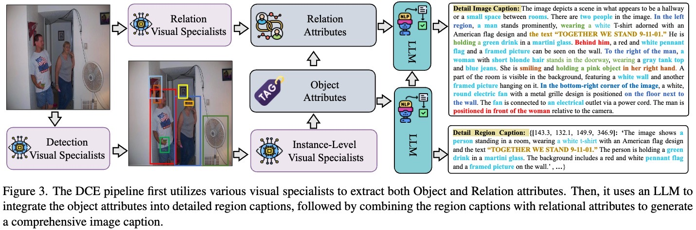
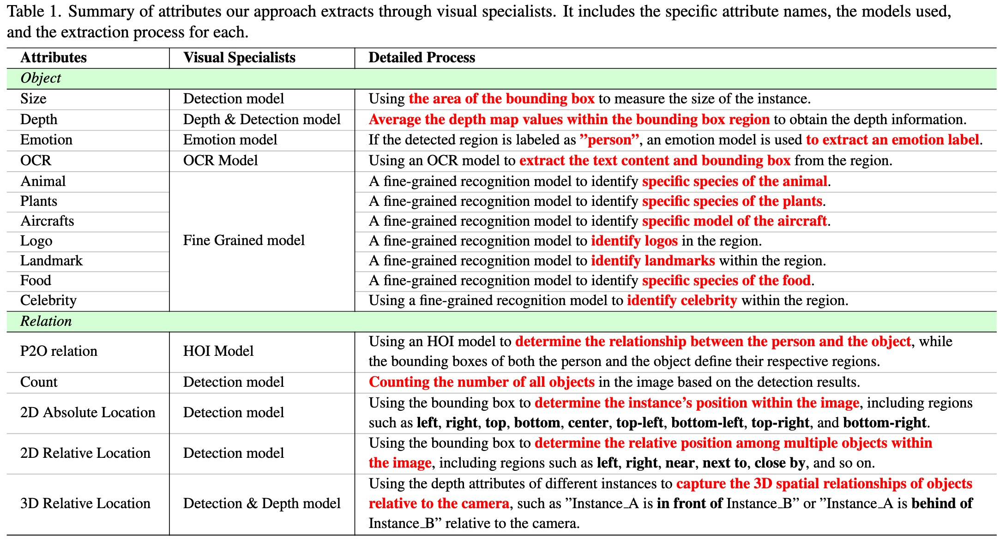

<h2 align="center"> <a href="https://arxiv.org/pdf/*****">Descriptive Caption Enhancement with Visual Specialists for Multimodal Perception </a></h2>
<h5 align="center"> If you like our project, please give us a star ⭐ on GitHub.  </h2>

## 📰 News

* **[2024.06.07]**  🔥🔥 Our data pipeline are available now !

* **[2024.06.07]**  🔥🤗 Our DCE-1M datasets is released, please check out and download in [DCE-1M](https://huggingface.co/datasets/syp115/DCE-1M)!

## 😮 Highlights
Training <strong><em>Large Multimodality Models (LMMs)s</em></strong> relies on descriptive image caption
that connects image
and language.
Existing methods either
distill the caption
from the LMM models
or construct the captions 
from the internet images or by human.
We propose to leverage off-the-shelf visual specialists,
which were trained from annotated images initially not for image captioning,
for enhancing the image caption.

Our approach, named <strong><em>DCE</em></strong>, explores object low-level and fine-grained attributes
(e.g., depth, emotion and fine-grained categories)
and object relations 
(e.g., relative location and human-object-interaction (HOI)),
and combine the attributes into the descriptive caption.
Experiments demonstrate that
such visual specialists are able to improve the performance
for visual understanding tasks
as well as reasoning that benefits from more accurate visual understanding. We will release the source code and the pipeline
so that other visual specialists are easily combined into the pipeline.

---
<strong><em>DCE</em></strong> leverage visual specialists to replicate various <strong><em>human visual capabilities</em></strong>, and subsequently employ large language models (LLMs) to simulate the <strong><em>human cognitive process</em></strong>. This combined approach enables us to generate high-quality image captions by closely mimicking the way humans perceive and interpret visual information.

<!-- Model Image-->
<section class="hero teaser">
  

    

      
      
    

  

</section>
<!-- End Model Image -->

